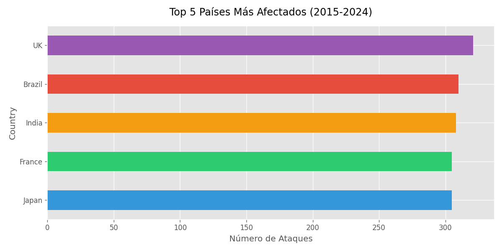
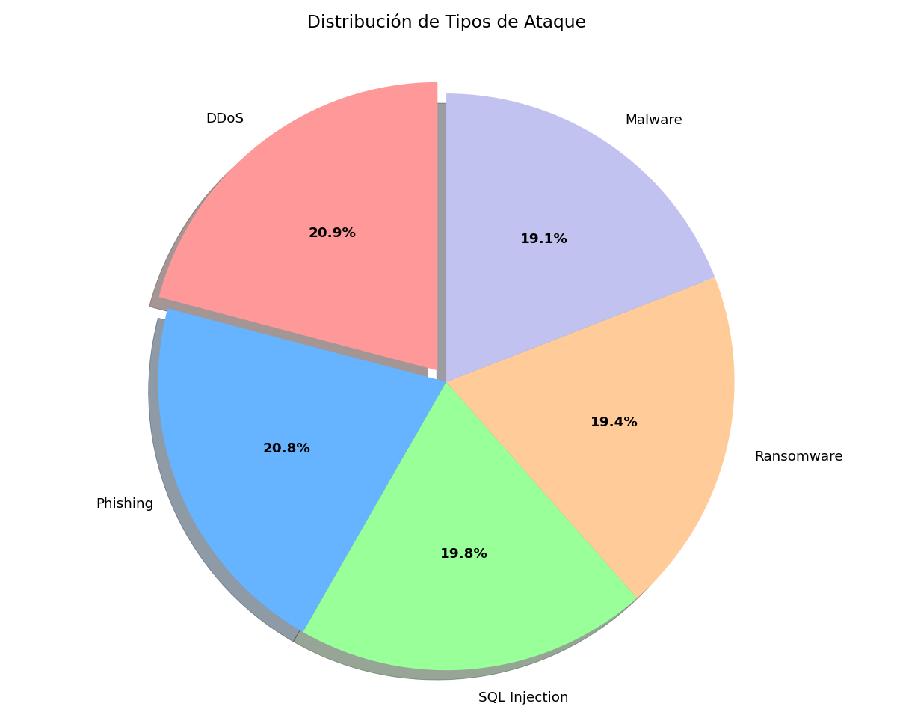
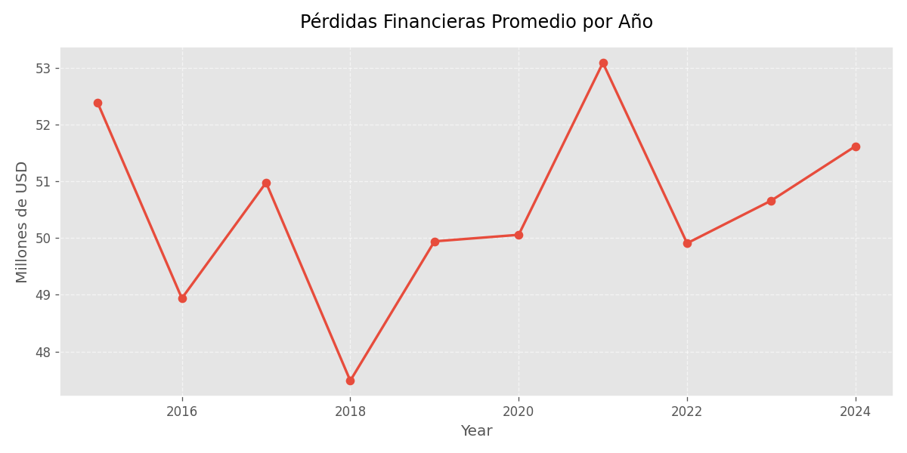

# GlobalCybersecurityThreatsDataScience
# 📊 Análisis de Ciberamenazas Globales (2015-2024)

[](https://www.python.org/)
[](https://pandas.pydata.org/)
[](https://matplotlib.org/)

Análisis de datos sobre ataques cibernéticos a nivel mundial, incluyendo patrones por país, tipo de amenaza e impacto económico.

## 📋 Contenido
- [Instalación](#instalación)
- [Resultados](#resultados)
- [Estructura](#estructura-del-proyecto) 
- [Tecnologías](#tecnologías)
- [Autor](#autor)

## 💻 Instalación
```bash
git clone https://github.com/Shadowcrys/GlobalCybersecurityThreatsDataScience.git
cd GlobalCybersecurityThreatsDataScience
pip install -r requirements.txt
```
# 📊 Resultados

Los gráficos generados se guardan automáticamente en la carpeta `/graficos`:

## 📌 Gráficos Generados

### 1. Análisis por Países
  
*Países con mayor número de ciberataques registrados*

### 2. Tipos de Amenazas  
  
*Proporción de diferentes tipos de ataques cibernéticos*

### 3. Evolución Temporal
  
*Variación de incidentes a lo largo del período 2015-2024*

---

### 🔍 Cómo visualizarlos
Ejecuta el script principal


